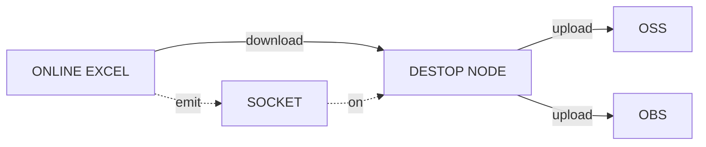

## 实现方案

```mermaid
graph LR
A[ONLINE EXCEL]
B[SOCKET]
C[DESTOP NODE]
D1[OSS]
D2[OBS]

A -.emit.-> B
A --download--> C
C --upload--> D1
C --upload--> D2
B -.on.-> C 

```

## 线上下载文件后发起通知代码

## 线下后端服务接受通知上传文件代码

- File.js：文件处理代码
- Socket_upload.js：消息通知接收并实现文件上传

